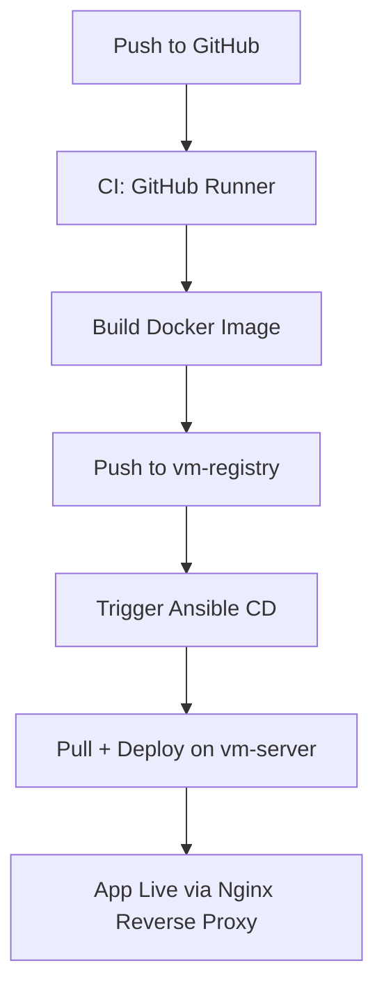

````markdown
# 🔧 Local CI/CD DevOps Pipeline with GitHub Actions, Docker & Ansible

A fully offline, self-contained CI/CD pipeline using local VMWareWorkstation VMs. Ideal for learning, development, and testing infrastructure automation with GitHub Actions (self-hosted), Docker containers, Ansible, and a local Docker registry.

## 📁 Project Structure

```bash
project/
├── .github/
│   └── workflows/
│       └── main.yml       # GitHub Actions pipeline (CI)
├── ansible/
│   ├── inventory.ini      # List of VMs for Ansible
│   └── playbook.yml       # Deployment script (CD)
├── app/                   # Backend Node.js application
│   ├── server.js
│   └── package.json
├── docker-compose.yml     # Multi-container stack definition


````

## ⚙️ Tech Stack

| Component     | Technology                          |
| ------------- | ----------------------------------- |
| CI            | GitHub Actions (self-hosted runner) |
| CD            | Ansible                             |
| Backend       | Node.js                             |
| Database      | MongoDB                             |
| DB Admin UI   | Mongo Express                       |
| Containers    | Docker + Docker Compose             |
| Registry      | Local Docker Registry               |
| Reverse Proxy | Nginx                               |
| Infra         | VMWareWorkstaion VMs                |

## 🌐 VM & Network Topology

| VM Role         | Hostname         | IP Address      | Responsibilities                          |
| --------------- | ---------------- | --------------- | ----------------------------------------- |
| Workstation     | `vm-workstation` | `192.168.10.1`  | Dev machine, self-hosted GitHub runner    |
| Docker Registry | `vm-registry`    | `192.168.10.20` | Hosts Docker registry (port `5000`)       |
| Production      | `vm-server`      | `192.168.10.10` | Runs containers, reverse proxy, app stack |

All VMs are connected via a host-only adapter (`192.168.10.0/24`).

## 🐳 Docker Containers

| Container       | Port  | Description                             |
| --------------- | ----- | --------------------------------------- |
| `node-app`      | 3000  | Node.js backend application             |
| `mongodb`       | 27017 | MongoDB database (internal only)        |
| `mongo-express` | 8081  | Web-based MongoDB admin UI (basic auth) |

**MongoDB Credentials:**

* `MONGO_INITDB_ROOT_USERNAME=admin`
* `MONGO_INITDB_ROOT_PASSWORD=password`

## 🔄 CI/CD Workflow

### CI: GitHub Actions (Self-Hosted)

1. Code pushed to GitHub triggers `main.yml`
2. The GitHub self-hosted runner on `vm-workstation`:

   * Builds Docker images
   * Tags images with `git-sha` or timestamp
   * Pushes images to local Docker registry

### CD: Ansible Playbook

1. GitHub Action triggers Ansible playbook
2. Ansible connects to `vm-server`:

   * Pulls Docker images from `vm-registry`
   * Runs `docker-compose up -d`
   * Ensures Nginx reverse proxy is configured

## 🛠️ Setup Instructions


### Step 1: Setup GitHub Self-hosted Runner on `vm-workstation`

* Install Docker, git, Node.js
* Register GitHub runner using GitHub's official guide
* Set the runner to work in your project directory

### Step 2: Deploy Local Docker Registry on `vm-registry`

```bash
docker run -d -p 5000:5000 --restart=always --name registry registry:2
```

### Step 3: Setup Inventory File for Ansible

```ini
[web]
192.168.10.10 ansible_user=ubuntu ansible_ssh_private_key_file=~/.ssh/id_rsa
```

## 🔓 Access Points

| Service         | URL                         | Auth                 |
| --------------- | --------------------------- | -------------------- |
| App             | `http://app.local`          | Public               |
| Mongo Express   | `http://app.local/mongo`    | `admin/password`     |
| Docker Registry | `http://192.168.10.20:5000` | No auth (local only) |

Ensure `app.local` is mapped in your `/etc/hosts`.

## 🔁 Workflow Diagram



## 🧪 Troubleshooting & Useful Commands

```bash
# View running containers
docker ps -a

# View container logs
docker-compose logs

# Rebuild everything
docker-compose down -v && docker-compose up -d --build

# Test app and Mongo Express
curl http://app.local
curl http://app.local/mongo
```

## 🔐 Security Notes

* MongoDB is not exposed to public
* Mongo Express uses basic authentication
* Docker registry accessible only on local network

## 📌 Notes

* 💡 All components are **fully offline** after initial setup.
* 🧪 Ideal for DevOps learning, testing infrastructure tools, and CI/CD automation.
* 🗃️ MongoDB uses persistent volumes.
